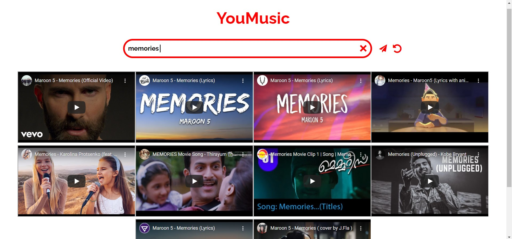

# [YouMusic](https://youmusicc.herokuapp.com/)


A music player which plays as well as downloads any song from YouTube

This application was developed after I found out that my father and his non-technical friends had troubles trying to download
songs from the internet and were being annoyed by the constant popping ads of YouTube premium

[Click here](https://github.com/smitdesai1010/YouMusic-ChromeExtension) for Chrome extension


<details>
    <summary style="cursor:pointer; font-size: 28px; font-weight: bold; font">Screenshots</summary>
    <p>
      
    </p>
    <p float="left">
      
      
    </p>
</details>

<br/>

## Working

* Upon searching
    * A request is made to the server 
    * The server makes a request to the YouTube Data V3 api 
      and return YouTube video ids of 10 matching videos
    * The clients makes iframe for respective videos and injects it into DOM
    * Client calls the YouTube iframe api to attach event listeners onto the iframes 

* Upon streaming
    * A request is made to the server for video meta-data
    * The server asychronously batch processes video using ytdl-core module
    * Audio data is stored in-memory (heap) and is served using HTTP range request
      Note: The client side work for streaming is automatically done by the http module in the browser

* Upon downloading
    * A request is made to the server for video meta-data
    * The server returns a stream of audio data which is used to download the file


## Optimizations

* Reduced latency by 290% by using range requests for streaming.
* Further reduced latency to real time by using in-memory cache.
* Optimized server performance by 22% by asychronous batch processing.
    * For batch processing, I decided to use the asychronous approach because as 
      node.js is single threaded, parallelism using child processes requires the creation of seperate processes, 
      which is resource-extensive.   
* Enhanced client satisfaction by 85% by building search UI instead of console style UI.
* Improved user experience by building a chrome extension
    * Chrome extension drastically reduces the number of clicks as the user
      can access the app's funtionality within YouTube.


## Future planning

* Use redis for in-memory caching.
* Use message queues.
* Add unit tests.
* Add a feature to suggest songs based on user's facial emotion.
* Test the efficiency of worker threads against asychronous batch processing.
* Improve UI and allow users to select audio quality.


  
## Run Locally

Install node and npm
```
  https://nodejs.org/en/download/
```

Clone the project

```
  git clone https://github.com/smitdesai1010/YouMusic.git
```

Add the following environment variables in a .env file located in the root directory of the project. 
<pre>
  <a href="https://developers.google.com/youtube/v3/getting-started
  ">YOUTUBEV3API</a>
</pre>

Go to the project directory
  
``` 
   npm install      //Install dependencies
   npm start        //starts server 
```

Go to http://localhost:3000/


## Acknowledgements

 - [YouTube Data V3 API](https://developers.google.com/youtube/v3/getting-started)
 - [YouTube Iframe API](https://developers.google.com/youtube/iframe_api_reference)
 - [ytdl-core](https://www.npmjs.com/package/ytdl-core)

  
## Feedback

If you have any feedback, please reach out to me at smitdesai1010@gmail.com
  
